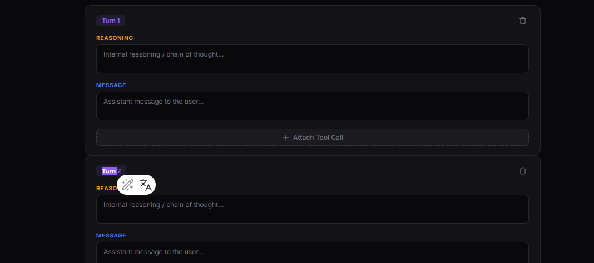

# Tool Use - Trajectory Builder

A benchmarking tool for comparing AI tool-use trajectories across different models. Write one prompt, generate trajectories from multiple models (Gemini, GPT-4, Claude, etc.), and compare them side by side.



## Features

- **Multi-trajectory tabs** — Unlimited tabs per prompt, each representing a different model's trajectory or a human baseline
- **AI agent generation** — Connect any OpenAI-compatible model, generate trajectories with real tool execution in real-time
- **Tool registry** — Auto-discovers tools from `tools/` directory, supports search, calculator, Wikipedia, and more
- **MCP server** — Exposes tools via Model Context Protocol at `/mcp/sse`
- **Export/Import** — Save and load multi-trajectory JSON files for comparison

## Quick Start

```bash
# Clone and configure
cp .env.example .env  # Add your API keys

# Run with Docker
docker compose up --build
```

Open http://localhost:8000

## Adding Tools

Drop a Python file in `tools/` following the template:

```python
from app.sdk import ToolServer

server = ToolServer("my-tool")

@server.register("do_something", description="What this tool does")
async def do_something(query: str) -> dict:
    return {"result": "..."}
```

The tool is auto-discovered on startup.

## Architecture

```
app/
  main.py          # FastAPI app
  router.py        # API endpoints
  agent.py         # AgentLoop (OpenAI-compatible)
  registry.py      # Tool auto-discovery
  mcp_server.py    # MCP SSE server
  static/index.html # Single-page UI
tools/             # Drop-in tool modules
system-prompt.md   # Editable agent system prompt
```

## Supported Providers

| Provider | Base URL |
|----------|----------|
| Gemini | `https://generativelanguage.googleapis.com/v1beta/openai/` |
| OpenAI | `https://api.openai.com/v1` |
| OpenRouter | `https://openrouter.ai/api/v1` |
| Together | `https://api.together.xyz/v1` |
| Groq | `https://api.groq.com/openai/v1` |
| Local (LM Studio) | `http://localhost:1234/v1` |
